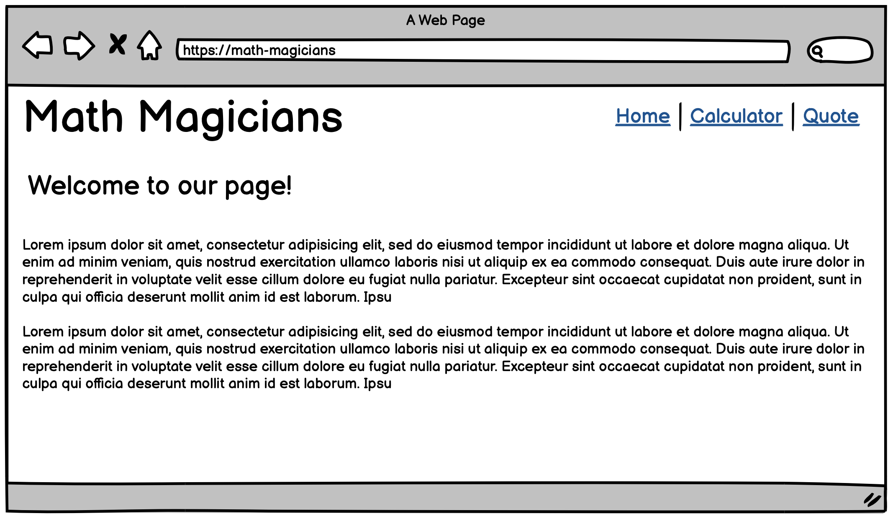
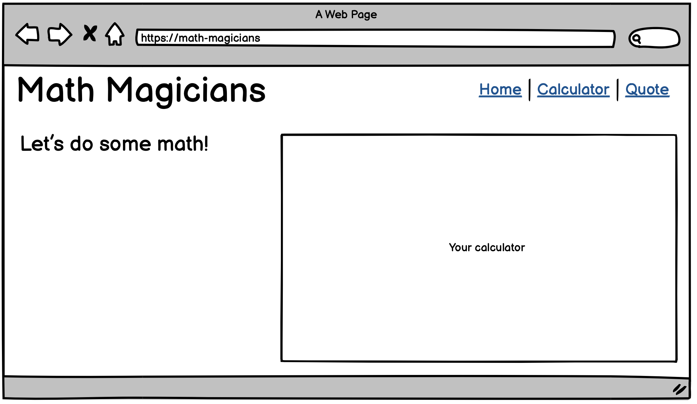
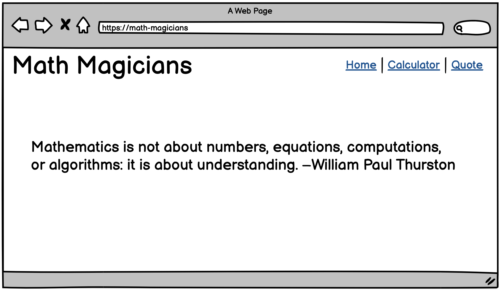

# Yuriy Chamkoriyski Math magicians project

> React app

## Description

This is the first project of the Math Magicians application. You will set up the environment and tools needed to develop a React application. In the following projects, you will develop the actual application.

## Requirements:

### Phase 1, setup project
- [x] The easiest way to create a React application is using Create React App (CRA) and following the instructions in this [guide](https://create-react-app.dev/docs/getting-started/).
- [x] The application should run in the browser without errors.

### Phase 2, components
- [x] Delete all the boilerplate from CRA (text, images, styles).
- [x] Create a directory called `components`.
- [x] Inside components, create a new `Calculator.js` file.
- [x] In `Calculator.js`, create a React component that matches the design from the screenshot above.
- [x] Don't add any extra design.
- [x] Develop just the UI of the calculator; the math logic to make it work will be added in the next project.
- [x] Use class based components.
- [x] Once the Calculator is ready, import it and use it in your main component (App.js).
- [x] Test it in the browser; it should render without problems.

### Phase 3, events
- [x] Copy the files [`calculate.js`](https://github.com/microverseinc/curriculum-react-redux/blob/main/math-magicians/code-samples/calculate.js) and [`operate.js`](https://github.com/microverseinc/curriculum-react-redux/blob/main/math-magicians/code-samples/operate.js) into a `logic/` directory in your project.
- [x] Analyze the files `calculate.js` and `operate.js`, be sure you understand what they do.
- [x] Import the files in your Calculator component.
- [x] Implement the event handlers you need to use the math logic from `calculate.js` and `operate.js` in your React component.
- [x] Practice what you have learned until now: use `state` and `props`, pass props to child components, use lifecycle methods, lift state up.
- [x] Test your app in the browser. It should be able to perform math operations.

### Phase 4, refactor with hooks
- [x] Refactor the Calculator component (`components/Calculator.js`) from a class based component to a functional component with hooks.
- [x] After the refactor is done, test the app in the browser. It should keep the same functionality.

### Phase 5, full website
- [x] Create a website consisting of 3 pages: Home, Calculator, and Quote.
- [x] The general layout should match these wireframes:

- [x] Add your own styles to improve the look and feel.
  - [x] In the lesson about styling, we introduced several ways to add styles in a React application:
    - [x] React basic styling (inline styles, importing CSS and pre-processed CSS files).
    - [x] CSS modules.
    - [x] Styled components.
  - [x] In this project, you should use React basic styling.
- [x] For every page, you should create a route.
- [x] Make sure that navigation links for all 3 routes are displayed on each page.
- [x] Use [React Router](https://reactrouter.com/) to make the routes work.

### Phase 6, tests
- [x] Set up React Testing Library.
  - [x] Follow the instructions in the official [documentation](https://testing-library.com/docs/react-testing-library/intro/).
  - [x] You don't need to setup Jest (it's included in Create React App).
- [x] Write unit tests for the files `operate.js` and `calculate.js` using Jest.
- [x] Create unit tests for all React components:
  - [x] Use Jest snapshots to test the components.
  - [x] Use React Testing Library to simulate user interaction.
- [x] Run your full tests suite using Jest. All tests should pass.
- [x] You need to use pair-programming for this project.

## Built With

- Major languages: Javascript
- Frameworks: React.js
- Technologies used: Node.js, Babel, Jest, webpack
- Tested with: - ESLint (JavaScript linting), Stylelint (style linting)

## Live Demo

- No deployment yet

### Prerequisites

- Internet connection and browser
- A text editor(preferably Visual Studio Code)
- Browser

### Setup

- This project was bootstrapped with [Create React App](https://github.com/facebook/create-react-app).

### Install

- [Git](https://git-scm.com/downloads)
- [Node](https://nodejs.org/en/download/)

### Usage

- Clone the repository using `git clone https://github.com/Hombre2014/math-magicians`
- Change directory into the project folder: `cd math-magicians`
- Run `npm install`
- Run `npm start`
- A new browser will open automatically with application loaded

## Available Scripts

In the project directory, you can run:

### `npm start`

Runs the app in the development mode.\
Open [http://localhost:3000](http://localhost:3000) to view it in your browser.

The page will reload when you make changes.\
You may also see any lint errors in the console.

### `npm test`

Launches the test runner in the interactive watch mode.\
See the section about [running tests](https://facebook.github.io/create-react-app/docs/running-tests) for more information.

### `npm run build`

Builds the app for production to the `build` folder.\
It correctly bundles React in production mode and optimizes the build for the best performance.

The build is minified and the filenames include the hashes.\
Your app is ready to be deployed!

See the section about [deployment](https://facebook.github.io/create-react-app/docs/deployment) for more information.

### `npm run eject`

**Note: this is a one-way operation. Once you `eject`, you can't go back!**

If you aren't satisfied with the build tool and configuration choices, you can `eject` at any time. This command will remove the single build dependency from your project.

Instead, it will copy all the configuration files and the transitive dependencies (webpack, Babel, ESLint, etc) right into your project so you have full control over them. All of the commands except `eject` will still work, but they will point to the copied scripts so you can tweak them. At this point you're on your own.

You don't have to ever use `eject`. The curated feature set is suitable for small and middle deployments, and you shouldn't feel obligated to use this feature. However we understand that this tool wouldn't be useful if you couldn't customize it when you are ready for it.

### Deployment

- Not ready yet

## Author

👤 **Yuriy Chamkoriyski**

- GitHub: [@Hombre2014](https://github.com/Hombre2014)
- Twitter: [@Chamkoriyski](https://twitter.com/Chamkoriyski)
- LinkedIn: [axebit](https://linkedin.com/in/axebit)

## 🤝 Contributing

Contributions, issues, and feature requests are welcome!

Feel free to check the [issues page](https://github.com/Hombre2014/math-magicians/issues).

## Show your support

Give a ⭐️ if you like this project!

## Acknowledgments

## 📝 License

This project is [MIT](./license.md) licensed.